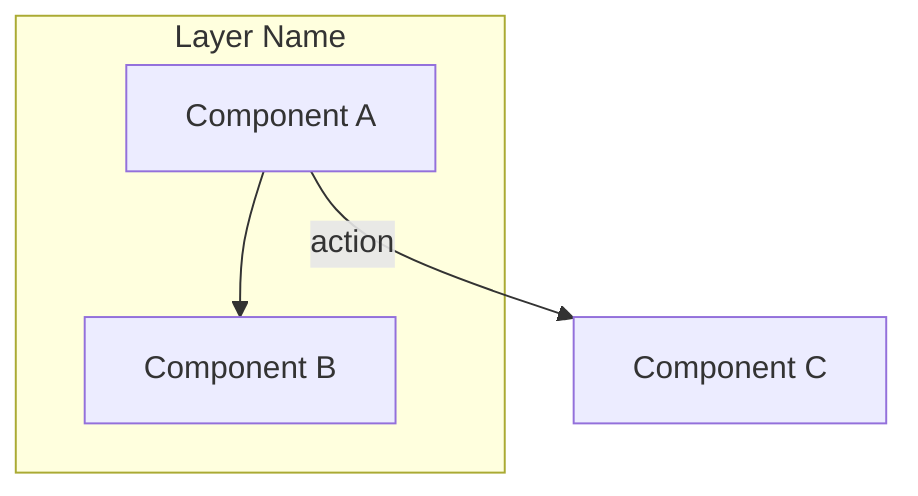
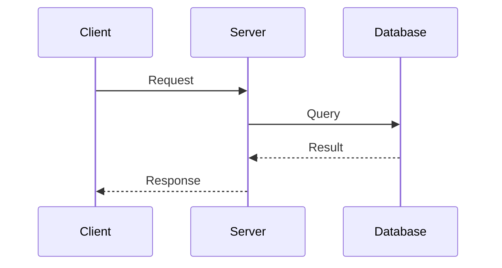
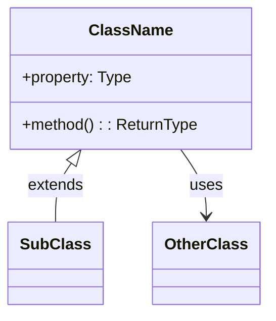
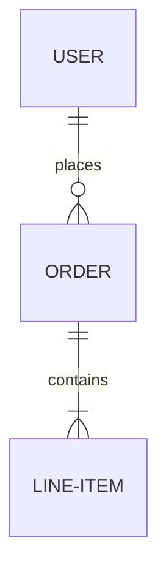
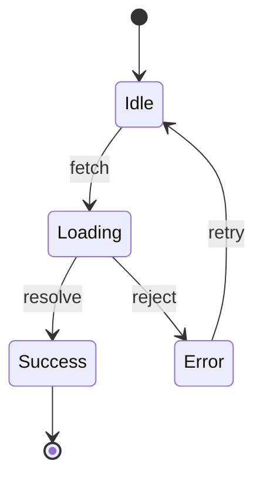

# Mermaid Diagram Generator

Use this skill to generate Mermaid diagrams from code files and directories to visualize system architecture, component relationships, data flow, or other structural aspects of a codebase.

## When to Use

- User asks to visualize or diagram code architecture
- User wants to see component relationships
- User needs to understand data flow in a system
- User asks for a flowchart, sequence diagram, class diagram, or ER diagram
- User wants to document system structure visually

## Process

### 1. Analyze the Codebase

Gather information about the specified files and directories:

**List all relevant files:**

- Use Glob to find files matching specified paths
- Filter by relevant file extensions (.ts, .tsx, .js, .jsx, .py, etc.)

**Read and parse the code:**

- Identify exports, imports, and dependencies
- Extract class definitions, functions, and interfaces
- Map relationships between modules
- Identify data flow patterns

**Identify key architectural elements:**

- Entry points and main modules
- Service layers and their interactions
- Data models and their relationships
- External integrations and APIs
- Event flows and async patterns

### 2. Determine Diagram Type

Select the most appropriate diagram type based on code structure and user intent:

| Diagram Type | Best For |
|--------------|----------|
| `flowchart` | General architecture, module relationships, process flows |
| `sequenceDiagram` | API calls, request/response flows, async operations |
| `classDiagram` | Object-oriented code, type hierarchies, data models |
| `erDiagram` | Database schemas, entity relationships |
| `stateDiagram` | State machines, component lifecycle, workflow states |
| `graph` | Dependency trees, import/export relationships |

If the user specifies a diagram type, use that. Otherwise, infer the best type from the code structure.

### 3. Build the Diagram

Construct the Mermaid diagram with these principles:

- **Clarity over completeness** - Focus on the most important relationships; don't include every function
- **Meaningful groupings** - Use subgraphs to group related components
- **Consistent naming** - Use the actual names from the codebase
- **Appropriate detail level** - Match detail to the scope of files provided
- **Direction** - Choose flow direction (TB, LR, etc.) that best represents the architecture

### 4. Add Annotations

Enhance the diagram with:

- Brief labels on relationships describing the interaction
- Notes for complex or non-obvious connections
- Color coding for different types of components (if helpful)
- Links to actual files where appropriate

## Output Format

```markdown
## Diagram Overview

[1-2 sentences describing what the diagram represents and the scope of analysis]

## Files Analyzed

- `path/to/file1.ts` - [brief description]
- `path/to/file2.ts` - [brief description]

## Mermaid Diagram

\`\`\`mermaid
[Generated diagram code]
\`\`\`

## Diagram Legend

| Symbol/Color | Meaning |
|--------------|---------|
| [element] | [description] |

## Key Relationships

1. **[Relationship Name]** - [explanation of this connection and its significance]
2. **[Relationship Name]** - [explanation]

## Notes

- [Any assumptions made during analysis]
- [Components intentionally omitted for clarity]
- [Suggestions for additional diagrams that might be useful]
```

## Diagram-Specific Syntax

### Flowcharts



Guidelines:

- Use subgraphs to represent layers or domains
- Show data flow direction with arrows
- Label edges with the type of interaction

### Sequence Diagrams



Guidelines:

- Focus on key interactions, not every function call
- Show async operations with appropriate arrow types
- Include error paths if significant

### Class Diagrams



Guidelines:

- Include public interfaces
- Show inheritance and composition relationships
- Use appropriate relationship symbols

### ER Diagrams



Guidelines:

- Focus on entities and their relationships
- Use proper cardinality notation
- Include key attributes

### State Diagrams



Guidelines:

- Show all meaningful states
- Label transitions with triggering events
- Include start and end states

## Handling Edge Cases

| Situation | Response |
|-----------|----------|
| No files found at specified paths | List what was searched and suggest corrections |
| Files contain no analyzable structure | Explain why and suggest what files might be more useful |
| Too many files for meaningful single diagram | Offer to create multiple focused diagrams or ask user to narrow scope |
| Mixed languages/frameworks | Note this and focus on the dominant pattern or ask for clarification |
| Circular dependencies detected | Include them in the diagram and highlight as a potential concern |

## Best Practices

- **Be pragmatic about scope** - For large directories, focus on main architectural patterns rather than every file
- **Infer intent** - If the user provides a specific subset of files, assume they want to understand that specific subsystem
- **Handle ambiguity** - If multiple diagram types would be appropriate, either ask the user or provide the most generally useful one with a note about alternatives
- **Keep diagrams renderable** - Ensure output is valid Mermaid syntax
- **Consider the audience** - Diagrams should be understandable by someone unfamiliar with the codebase
